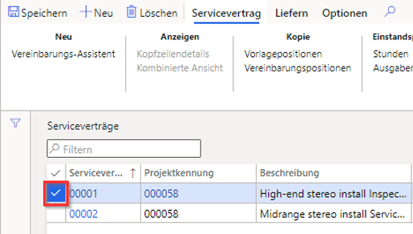
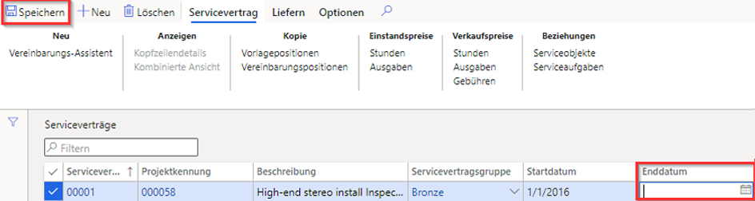

---
lab:
    title: 'Lab 7: Geplanten Arbeitsauftrag erstellen'
    module: 'Modul 1: Grundlagen von Microsoft Dynamics 365 Supply Chain Management erlernen'
---

## Lab 7 – Geplanten Arbeitsauftrag erstellen

## Ziele

Wartungsaufträge, die in das System eingegeben werden, beschreiben die an einer Anlage erforderliche Wartung oder Reparatur und weisen die entsprechenden Ressourcen zur Erledigung der Wartungsanforderung zu. Ihr Unternehmen hat einen laufenden Servicevertrag und muss sicherstellen, dass geplante Serviceaufträge erstellt werden, um die vereinbarten Serviceleistungen für Vertragsgegenstände bereitzustellen.

## Lab-Einrichtung

   - **Geschätzte Dauer**: 10 Minuten

## Anweisungen

1. Überprüfen Sie auf der Finance and Operations-Startseite oben rechts, ob Sie mit dem USMF-Unternehmen zusammenarbeiten.

1. Wählen Sie bei Bedarf das Unternehmen und im Menü **USMF** aus.

1. Wählen Sie im linken Navigationsbereich **Module** > **Serviceverwaltung** > **Servicevereinbarungen** > **Servicevereinbarungen** aus.

1. Aktivieren Sie das Kontrollkästchen in der ersten Spalte der ersten Servicevereinbarung.

    

1. Wählen Sie das Feld **Enddatum** aus, löschen Sie den aktuellen Wert, und wählen Sie dann im oberen Menü **Speichern** aus.  
 Das Enddatum wird entfernt, damit ein neuer Serviceauftrag für diese Vereinbarung erstellt werden kann.

    

1. Wählen Sie oben im Menü **Bereitstellen** aus.

1. Wählen Sie **Geplante Serviceaufträge** auf der Menübandleiste **Erstellen** aus.

1. Stellen Sie im Bereich Serviceaufträge unter **PERIODE** die Option **Von Datum** auf das heutige Datum und **Bis Datum** auf zwei Tage später ein.

1. Wählen Sie unter **INFOLOG** den Schalter **Infolog anzeigen** aus, um ihn auf **Ja** einzustellen.  
Daraufhin wird eine Liste der Serviceaufträge angezeigt, die in der Vereinbarung erstellt wurden.

1. Wählen Sie unter **TRANSAKTIONSTYPEN EINSCHLIESSEN** den Schalter **Stunden** aus, um ihn auf **Ja** einzustellen.  
Die Transaktionsarten stellen die in der Servicevereinbarung erstellten Positionen dar. Jede ausgewählte Transaktionsart generiert mehrere Serviceaufträge, abhängig von dem in der Servicevereinbarung festgelegten Serviceintervall.

1. Wählen Sie unter **OPTION** den Schalter **Fortlaufend** aus, um ihn auf **Ja** einzustellen.  
Dies wird verwendet, um Serviceaufträge zu erstellen, die in einer fortlaufenden Reihe von Serviceaufträgen fehlen.

1. Wählen Sie **OK** aus.
