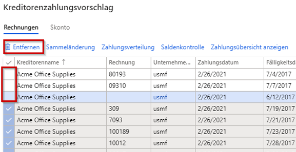

---
lab:
    title: 'Lab 2: Kreditorenzahlungserfassung erstellen'
    module: 'Modul 2: Grundlagen von Microsoft Dynamics 365 Finance erlernen'
---

## Lab 2 – Kreditorzahlungserfassung erstellen

## Ziele

Organisationen, die regelmäßige Zahlungen an Kreditoren leisten, können den Prozess zum Generieren von Kreditorenzahlungsvorschlägen jetzt automatisieren. Beim Automatisieren von Kreditorenzahlungsvorschlägen werden folgende Details definiert:

- Wann Zahlungsvorschläge ausgeführt werden
- Welche Kriterien zum Auswählen der zu bezahlenden Rechnungen angewendet werden
- In welcher Kreditorenzahlungserfassung die resultierenden Zahlungen gespeichert werden

Bei der Automatisierung von Zahlungsvorschlägen werden die Zahlungen nicht automatisch gebucht. Daher können Sie weiterhin alle derzeit von Ihnen genutzten Überprüfungs- und Workflowprozesse verwenden, um die erstellten Zahlungen zu genehmigen.

Erstellen Sie einen neuen Eintrag in der Kreditorenzahlungserfassung und einen Zahlungsvorschlag.

## Lab-Einrichtung

   - **Geschätzte Dauer**: 10 Minuten

## Anweisungen

1. Überprüfen Sie auf der Finance and Operations-Startseite oben rechts, ob Sie mit dem USMF-Unternehmen zusammenarbeiten.

1. Wählen Sie bei Bedarf das Unternehmen und im Menü **USMF** aus.

1. Wählen Sie im linken Navigationsbereich **Module** > **Kreditorenkonten** > **Zahlungen** > **Kreditorenzahlungserfassung** aus.

1. Wählen Sie oben im Menü **+ Neu** aus.

1. Beachten Sie die neue Erfassungschargennummer, die erstellt wurde.

1. Geben Sie im Feld **Name** den Text **Kred.** ein, und wählen Sie **VendPay** aus der gefilterten Liste aus.

1. Wählen Sie im oberen Menü **Positionen** aus.

1. Wählen Sie auf der Seite „Kreditorenzahlungen“ im oberen Menü **Zahlungsvorschlag** > **Zahlungsvorschlag erstellen** aus.  
    Der Zahlungsvorschlag ist eine Abfrage zur Auswahl von Rechnungen für die Zahlung. Sie können die Liste der zu zahlenden Rechnungen bearbeiten, bevor Sie die Kreditorenzahlungen erstellen oder generieren.

    

1. Wählen Sie im Bereich Kreditorenzahlungsvorschlag unter **RECHNUNGSAUSWAHLKRITERIEN** das Menü **Rechnungen auswählen nach** aus, überprüfen Sie die verfügbaren Optionen und klicken Sie dann auf **Fälligkeitsdatum**.

1. Löschen Sie in den Feldern **Von Datum** und **Bis Datum** alle vorhandenen Werte. In dieser Übung bleiben diese Datumsbereiche leer.

    >[!Hinweis] Möglicherweise wird ein Mindestzahlungsdatum als Zahlungsdatum verwendet. Das Mindestzahlungsdatum ist das früheste Datum, an dem Zahlungen erstellt werden. Angenommen, eine Rechnung weist ein Fälligkeitsdatum nach dem Mindestzahlungsdatum auf. In diesem Fall ist das spätestmögliche Zahlungsdatum zum Begleichen der Rechnung das Fälligkeitsdatum anstelle des Mindestzahlungsdatums.

1. Erweitern Sie **Einzuschließende Datensätze**, und überprüfen Sie die Optionen.  
    Der Filter wird häufig verwendet, um die zur Zahlung ausgewählten Rechnungen nach Kreditorengruppen oder Zahlungsmethoden einzuschränken. Sie können beispielsweise einen Filter hinzufügen, um in diesem Zahlungslauf Rechnungen nur per Scheck zu bezahlen.

1. Erweitern Sie **Erweiterte Parameter**, und überprüfen Sie die verfügbaren Optionen.  
    Die zusätzlichen Parameter können verwendet werden, um die Zahlungswährung zu definieren oder um zentralisierte Zahlungen für diesen Zahlungslauf zu aktivieren.

1. Wählen Sie **OK** aus.  
    Nach dem Klicken auf „OK“ werden die Ergebnisse der Abfrage angezeigt. Wenn Sie die Liste der zur Zahlung ausgewählten Rechnungen nicht in der Vorschau anzeigen möchten, kehren Sie zum Inforegister „Parameter“ zurück, und ändern Sie **Zahlungen ohne Rechnungsvorschau erstellen** in **Ja**.

1. Wählen Sie im Fenster Kreditorenzahlungsvorschlag **Zahlungsübersicht anzeigen** aus, um die Zahlungen anzuzeigen, die für den Kreditor für die ausgewählten Rechnung erstellt werden.

    

1. Wählen Sie im Menü die Option **Zahlungsübersicht ausblenden** aus, um die Zahlungen auszublenden.

1. Wählen Sie das Häkchensymbol links neben der Spaltenüberschrift **Kreditorenname** zur Auswahl aller Rechnungen aus.

    

1. Deaktivieren Sie das Kontrollkästchen für die ersten drei Rechnungen, und wählen Sie dann im Menü die Option **Entfernen** aus, um alle anderen Rechnungen zu entfernen.

    

1. Wählen Sie im Dialogfeld die Option **Ja** aus.

1. Überprüfen Sie die verbleibenden drei Rechnungen.

1. Klicken Sie mit der rechten Maustaste auf das Raster und wählen Sie eine Exportoption aus, um die Liste der Rechnungen nach Excel zu exportieren.

1. Wählen Sie in der unteren rechten Ecke **Zahlungen erstellen** aus, um die Kreditorenzahlungen in der Zahlungserfassung zu erstellen.

1. Überprüfen Sie die Liste der Kreditorenzahlungen.
